# Seven Kingdoms Portal

A deliberately vulnerable web application themed around Game of Thrones, designed for **security training**, **OCI Observability demonstrations**, and **CTF-style challenges**. Built with FastAPI and vanilla JS, fully instrumented with OpenTelemetry for attack detection via OCI APM and Log Analytics.

> **Warning**: This application contains intentional security vulnerabilities. Deploy only in isolated lab environments.

## Screenshots

### Dashboard
The Kingdom Overview shows real-time stats: 30 vulnerabilities, 10 OWASP categories, 3 GOAD domains. The Quick Attack Panel lets you trigger critical attacks (SQLi, RCE, SSRF, Path Traversal, JWT bypass, Crypto leak) with one click.

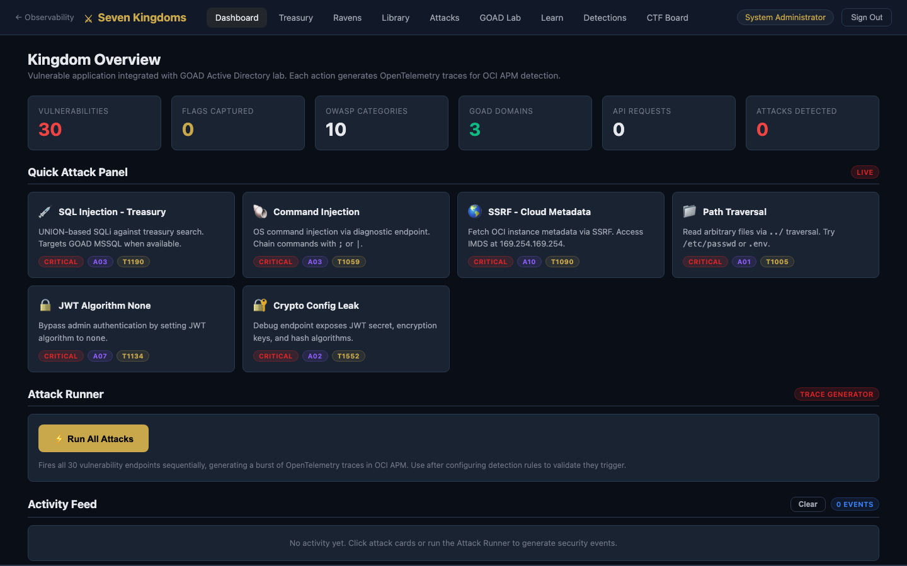

### Attack Encyclopedia (Learn Tab)
Comprehensive educational guide to every vulnerability. Each entry documents how the attack works, what OpenTelemetry span attributes are generated, and how to detect it in OCI APM and Log Analytics.

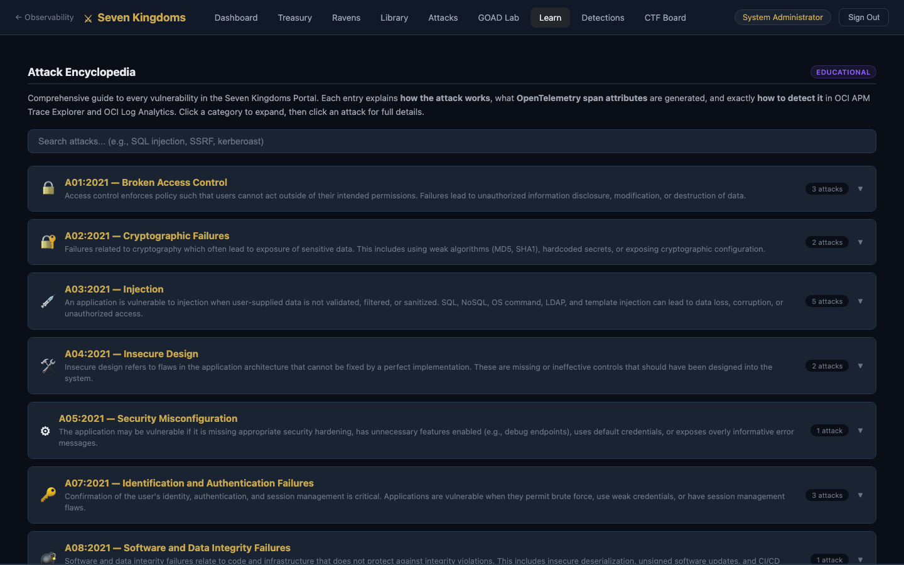

Expand any attack for step-by-step exploitation walkthrough, example payloads, real-world impact, and MITRE ATT&CK mapping:

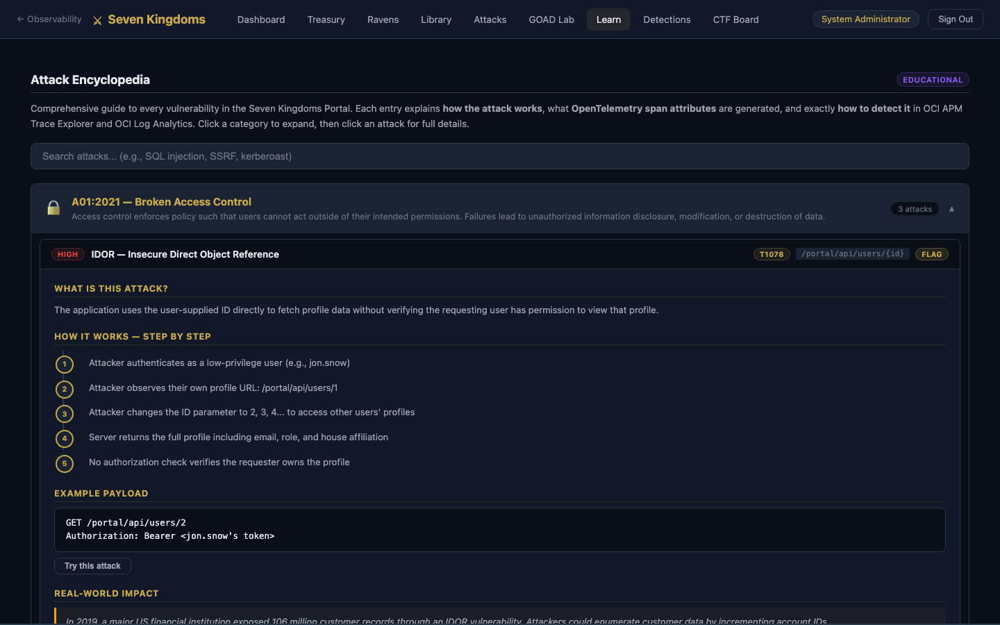

Each attack includes side-by-side detection queries for OCI APM Trace Explorer and OCI Log Analytics, with copy-to-clipboard buttons:

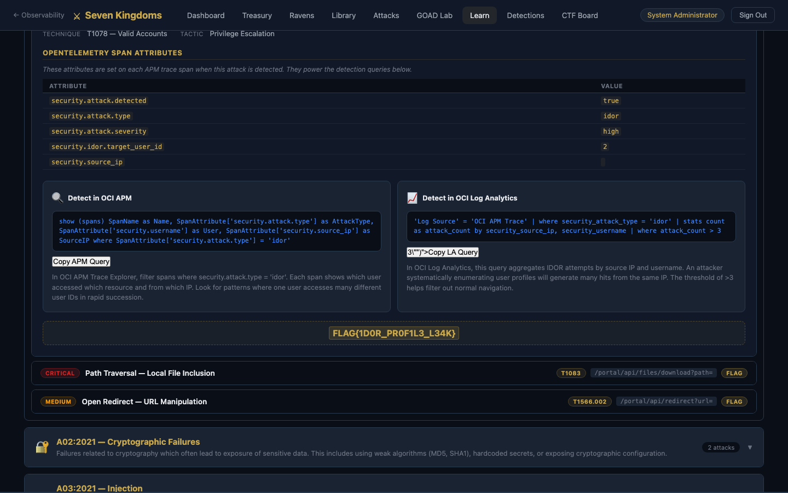

### Detection Rules
Browse all 20 detection rules with severity badges, MITRE technique IDs, OWASP categories, and one-click query copying:

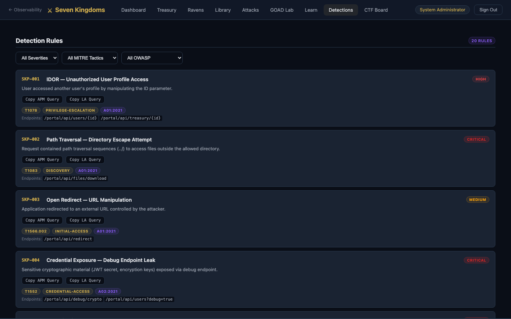

### Login
Game of Thrones themed login with multiple user accounts and domain authentication (for GOAD Active Directory integration):

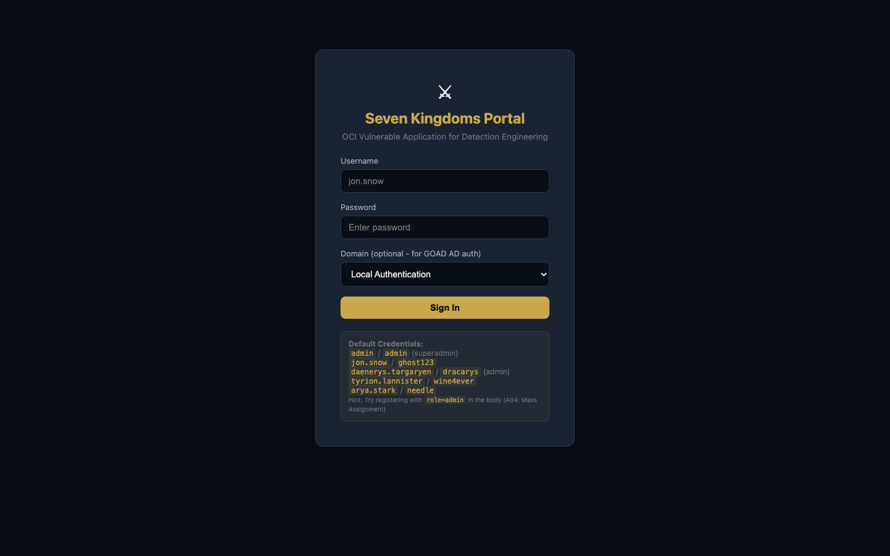

### CTF Platform (`/vulnerable`)
Full capture-the-flag interface with 18 challenges across Web Application Attacks, GOAD Active Directory Attacks, and UX Degradation Scenarios. Each challenge card shows OWASP category, severity badge, endpoint, and OTel instrumentation status.

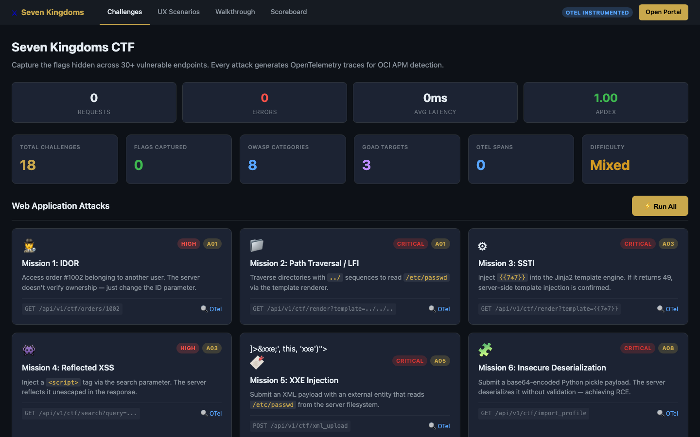

GOAD integration: Mission 7 (MSSQL Injection) and Mission 8 (SSRF) target the Active Directory lab. UX scenarios generate APM traces for observability demonstrations:

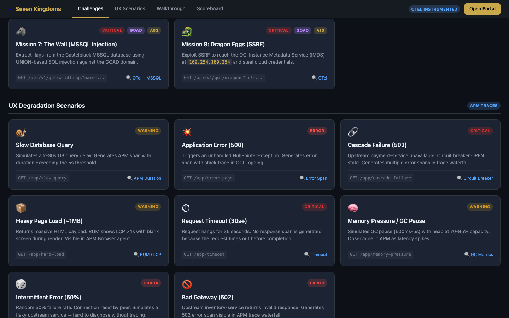

Click any challenge to fire the attack — the response panel shows HTTP status, latency, and auto-extracts flags via regex:

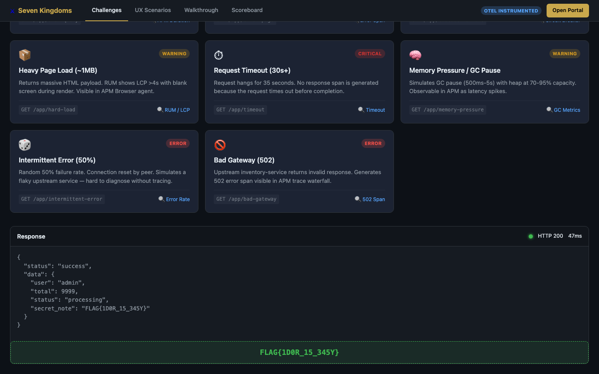

### CTF Walkthrough Guides
Step-by-step exploitation guides with curl commands, expected output, and OCI APM detection queries:

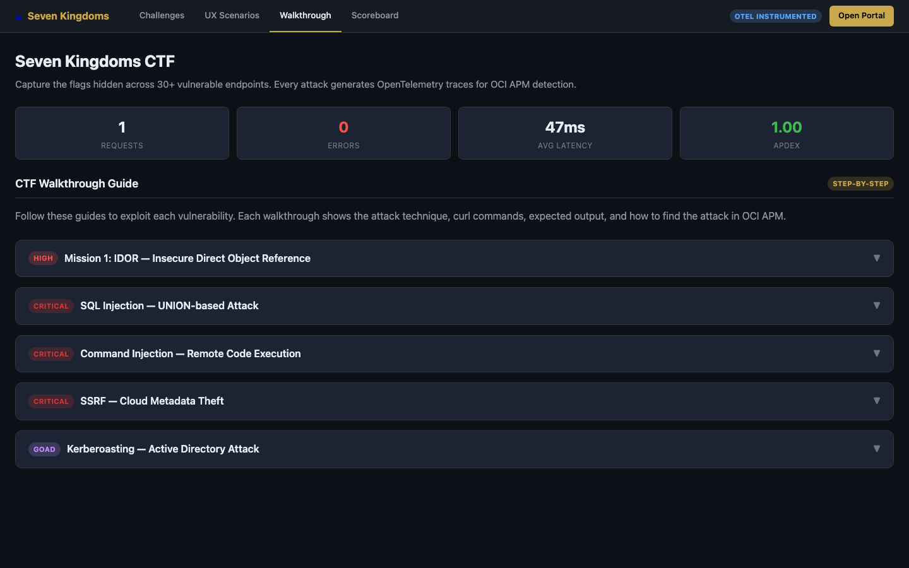

Expand any guide for the full attack flow — from understanding the target to detecting the attack in OCI APM Trace Explorer:

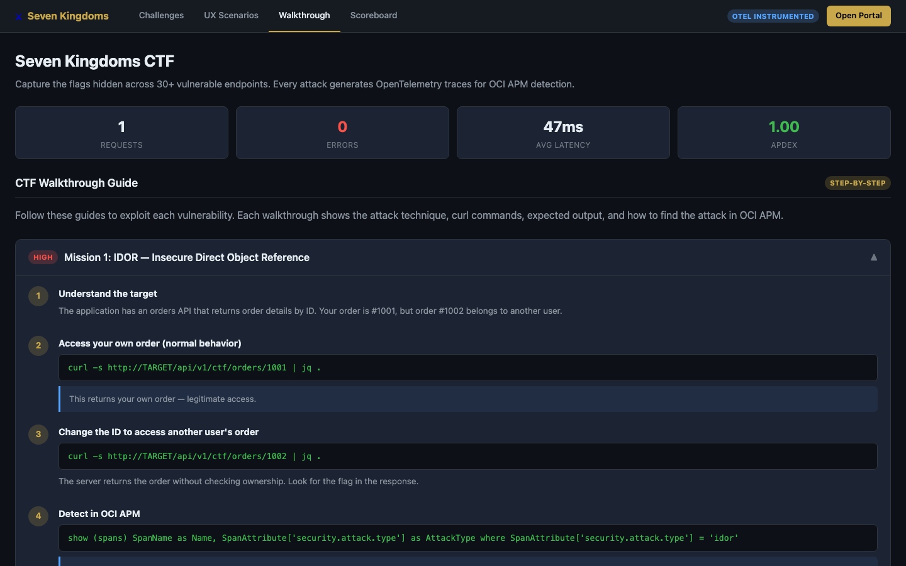

## What is this?

Seven Kingdoms Portal is a "GOAD-style" (Game of Active Directory) web application that provides:

- **30 intentional vulnerabilities** across OWASP Top 10 categories (SQLi, XSS, SSRF, IDOR, RCE, SSTI, etc.)
- **22 attack entries** in the Attack Encyclopedia with educational walkthroughs
- **20 detection rules** with pre-built APM + Log Analytics queries
- **Full OpenTelemetry instrumentation** — every attack generates traces with security-specific span attributes
- **OCI Observability integration** — APM, Log Analytics, Monitoring, custom metrics
- **Interactive attack runner** — trigger vulnerabilities from the UI and see them detected in real-time

## How Attacks Work

### Attack Flow
```
User triggers attack (UI or API)
  → FastAPI endpoint processes malicious input
  → OpenTelemetry span records security attributes
  → OCI APM receives the trace
  → Detection rules match span attributes
  → Alert fires in OCI Monitoring
```

### Example: SQL Injection (A03)

1. **Attack**: User sends `' UNION SELECT username, password FROM users--` to the treasury search
2. **OTel Span**: Sets `security.attack.type=sqli`, `security.attack.severity=critical`, `security.sqli.payload=...`
3. **APM Detection**: `show (spans) where SpanAttribute['security.attack.type'] = 'sqli'`
4. **LA Detection**: `'Log Source' = 'OCI APM Trace' | where security_attack_type = 'sqli' | stats count by security_source_ip`

### Example: Kerberoasting (GOAD)

1. **Attack**: Portal sends Kerberoasting request to GOAD domain controller
2. **OTel Span**: Sets `security.attack.type=kerberoast`, `security.goad.target_domain=sevenkingdoms.local`
3. **APM Detection**: Filter spans where `security.attack.type = 'kerberoast'`
4. **Windows Event**: Event ID 4769 (TGS request with RC4 encryption) in domain controller logs

## OWASP Categories Covered

| Category | Attacks | Examples |
|----------|---------|----------|
| A01: Broken Access Control | 3 | IDOR, Path Traversal, Open Redirect |
| A02: Cryptographic Failures | 2 | Config Exposure, MD5 Hashes |
| A03: Injection | 5 | SQLi, RCE, SSTI, LDAP Injection, Stored XSS |
| A04: Insecure Design | 2 | Mass Assignment, Negative Transfer |
| A05: Security Misconfiguration | 1 | Environment Variable Exposure |
| A07: Auth Failures | 3 | JWT None, Default Credentials, Session Fixation |
| A08: Integrity Failures | 1 | Pickle Deserialization |
| A09: Logging Failures | 2 | Silent Transfer, Log Injection |
| A10: SSRF | 1 | Cloud IMDS Metadata Access |
| GOAD (AD Attacks) | 2 | Kerberoasting, DCSync |

## Features

### Security / CTF
- **Attack Encyclopedia**: Educational walkthrough for every vulnerability with step-by-step exploitation, OTel attributes, and detection queries
- **Detection Rules Tab**: Browse all 20 detection rules with copy-to-clipboard APM/LA queries
- **Attack Runner**: Execute all 30 attacks sequentially to generate APM traces
- **Activity Feed**: Real-time log of all security events
- **CTF Scoreboard**: Flag-based scoring across all vulnerability categories
- **GOAD Integration**: Kerberoasting and DCSync attacks against Active Directory lab

### OCI Observability Overview
- **Command Center**: Unified view of all OCI O&M services
- **Service Modules**: Log Analytics, APM, Ops Insights, Database Management, and more
- **Interactive Mindmap**: Visual service relationship explorer
- **OCI Monitoring Query Builder**: MQL generation tool
- **AI Chat Assistant**: OCI Observability Q&A
- **Dark/Light/Redwood Themes**: Multiple theme support with glassmorphism effects

### Deployment
- **Multi-infrastructure**: VM, Docker, OCI Container Instances, OKE (Kubernetes)
- **12-Factor Config**: All settings via environment variables — no baked-in config files
- **Terraform IaC**: Full OCI infrastructure (VCN, Compute, LB, WAF, DNS)
- **Kustomize Overlays**: Dev/prod Kubernetes configurations

## Quick Start

### Local Development

```bash
python -m venv .venv
source .venv/activate
pip install -r requirements.txt
./scripts/start.sh
# Open http://127.0.0.1:9010
```

### Docker

```bash
# Copy and configure environment
cp .env.local.example .env.local

# Build and run
cd deploy/docker
docker compose up -d

# Check health
curl http://localhost:9010/health
```

### Deploy to OCI (VM)

```bash
# 1. Configure terraform variables
cd deploy/terraform/environments/prod
cp terraform.tfvars.example terraform.tfvars
# Edit terraform.tfvars with your OCI credentials

# 2. Deploy infrastructure
cd deploy && ./scripts/deploy.sh --environment prod --mode vm

# 3. Deploy application
export SSH_KEY=~/.ssh/your_private_key
./scripts/deploy-app.sh --mode vm --environment prod

# 4. Verify
curl http://$(terraform output -raw lb_public_ip)/health
```

### Deploy to OKE (Kubernetes)

```bash
./scripts/deploy-app.sh --mode oke \
  --registry fra.ocir.io/namespace \
  --tag v1.0.0
```

### Deploy to OCI Container Instance

```bash
./scripts/deploy-app.sh --mode container-instance \
  --registry fra.ocir.io/namespace \
  --tag v1.0.0
```

## Architecture

```
Internet → WAF → Load Balancer (public subnet) → App VM (private subnet, port 9010)
                  Bastion (public subnet) ──SSH──► App VM (port 22)
```

## Endpoints

| Endpoint | Purpose |
|----------|---------|
| `/health` | Liveness probe — app vitality |
| `/ready` | Readiness probe — dependency checks |
| `/portal/` | Seven Kingdoms Portal UI |
| `/portal/api/detection-rules` | Detection rules API |
| `/vulnerable` | CTF platform — challenges, walkthroughs, scoreboard |
| `/` | OCI Observability Overview dashboard |

## Environment Variables

See [`.env.local.example`](.env.local.example) for the full list. Key variables:

| Variable | Purpose | Default |
|----------|---------|---------|
| `APP_PORT` | Application port | `9010` |
| `APP_WORKERS` | Uvicorn worker count | `4` |
| `ENVIRONMENT` | Runtime environment | `development` |
| `OCI_AUTH_MODE` | OCI SDK auth method | `instance_principal` |
| `OCI_APM_ENDPOINT` | APM collector endpoint | — |
| `PORTAL_JWT_SECRET` | JWT signing secret | random |

## Detection Rules

All 20 rules map to MITRE ATT&CK techniques and OWASP Top 10 categories:

| ID | Attack | Severity | MITRE | OWASP |
|----|--------|----------|-------|-------|
| SKP-001 | IDOR | High | T1078 | A01:2021 |
| SKP-002 | Path Traversal | Critical | T1083 | A01:2021 |
| SKP-005 | SQL Injection | Critical | T1190 | A03:2021 |
| SKP-006 | Command Injection | Critical | T1059 | A03:2021 |
| SKP-009 | Stored XSS | High | T1059.007 | A03:2021 |
| SKP-017 | SSRF | Critical | T1090 | A10:2021 |
| SKP-018 | Kerberoasting | Critical | T1558.003 | N/A |
| ... | [+13 more](server/detection_rules.py) | | | |

## Re-generating Screenshots

```bash
npm install
node docs/take-screenshots.mjs      # Portal screenshots
node docs/take-ctf-screenshots.mjs   # CTF platform screenshots
```

## License

MIT

## Acknowledgments

- Inspired by [GOAD](https://github.com/Orange-Cyberdefense/GOAD) (Game of Active Directory)
- Built for [OCI](https://www.oracle.com/cloud/) Observability & Security demonstrations
