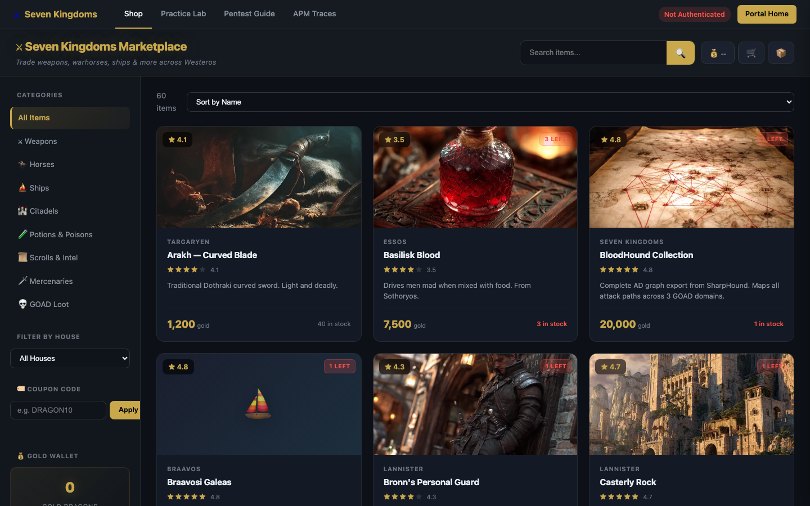
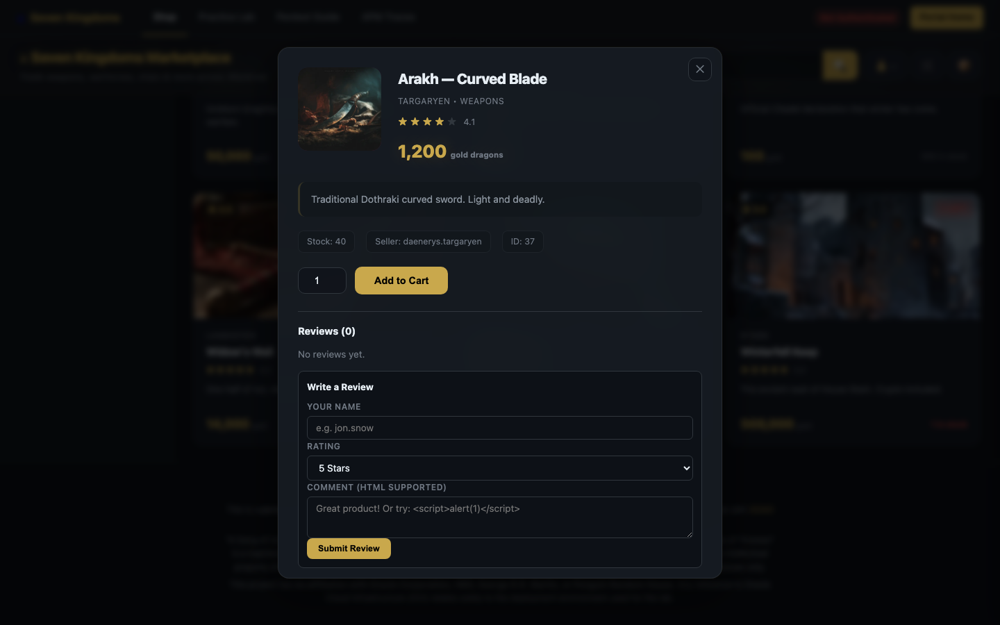
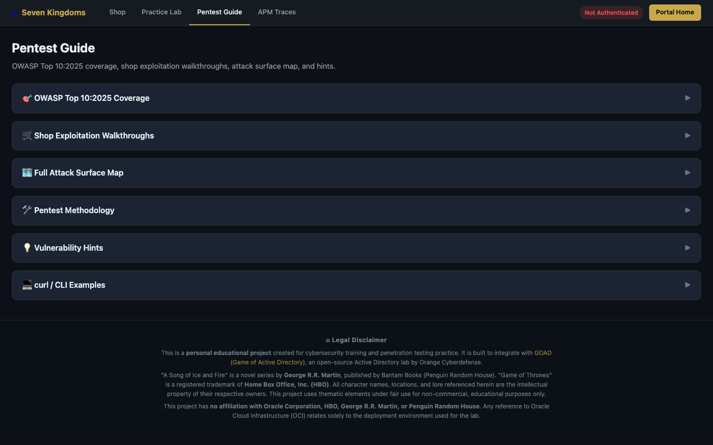

# Seven Kingdoms Portal

A deliberately vulnerable web application themed around Game of Thrones, designed for **security training**, **OCI Observability demonstrations**, and **CTF-style challenges**. Built with FastAPI and vanilla JS, fully instrumented with OpenTelemetry for attack detection via OCI APM and Log Analytics.

> **Warning**: This application contains intentional security vulnerabilities. Deploy only in isolated lab environments.

## Deploy to Oracle Cloud

[](https://cloud.oracle.com/resourcemanager/stacks/create?zipUrl=https://github.com/adibirzu/seven-kingdoms-portal/archive/refs/heads/main.zip)

> Set **Working Directory** to `stack/` when creating the stack. This deploys the complete platform: VCN, OKE cluster, GOAD Active Directory lab (optional), observability, WAF, and the vulnerable app — all automatically orchestrated.

## Screenshots

### Dashboard
The Kingdom Overview shows real-time stats: 33 vulnerability types, 9 OWASP categories, 3 GOAD domains. The Quick Attack Panel lets you trigger critical attacks (SQLi, RCE, SSRF, Path Traversal, JWT bypass, Crypto leak) with one click.


### Attack Encyclopedia (Learn Tab)
Comprehensive educational guide to every vulnerability. Each entry documents how the attack works, what OpenTelemetry span attributes are generated, and how to detect it in OCI APM and Log Analytics.


Expand any attack for step-by-step exploitation walkthrough, example payloads, real-world impact, and MITRE ATT&CK mapping:


Each attack includes side-by-side detection queries for OCI APM Trace Explorer and OCI Log Analytics, with copy-to-clipboard buttons:


### Detection Rules
Browse all 38 detection rules with severity badges, MITRE technique IDs, OWASP categories, and one-click query copying:


### Login
Game of Thrones themed login with multiple user accounts and domain authentication (for GOAD Active Directory integration):


### CTF Platform (`/vulnerable`)
Full capture-the-flag interface with 18 challenges across Web Application Attacks, GOAD Active Directory Attacks, and UX Degradation Scenarios. Each challenge card shows OWASP category, severity badge, endpoint, and OTel instrumentation status.


GOAD integration: Mission 7 (MSSQL Injection) and Mission 8 (SSRF) target the Active Directory lab. UX scenarios generate APM traces for observability demonstrations:


Click any challenge to fire the attack — the response panel shows HTTP status, latency, and auto-extracts flags via regex:


### Enhanced Marketplace (Shop)
60 products across 9 categories (Weapons, Horses, Ships, Citadels, Potions, Scrolls, Mercenaries, GOAD Loot) with Midjourney-generated product images, star ratings, house affiliations, and 19 exploitable endpoints.



Click any product to open the detail modal — purchase system, reviews with stored XSS hints, and seller metadata:



### Pentest Guide
OWASP Top 10:2025 coverage, shop exploitation walkthroughs, full attack surface map, methodology guide, vulnerability hints, and curl/CLI examples:



### CTF Walkthrough Guides
Step-by-step exploitation guides with curl commands, expected output, and OCI APM detection queries:


Expand any guide for the full attack flow — from understanding the target to detecting the attack in OCI APM Trace Explorer:


## What is this?

Seven Kingdoms Portal is a "GOAD-style" (Game of Active Directory) web application that provides:

- **98 API endpoints** across 3 server modules with **33 unique vulnerability types** spanning all OWASP Top 10 categories (SQLi, NoSQL injection, XSS, SSRF, IDOR, RCE, SSTI, XXE, CSRF, CRLF injection, web shell upload, price tampering, coupon forgery, prototype pollution, etc.)
- **Enhanced Marketplace** — Juice Shop-inspired e-commerce tab with 19 exploitable business logic endpoints
- **33 attack types** in the Attack Encyclopedia with educational walkthroughs
- **38 detection rules** (SKP-001 to SKP-038) with pre-built APM + Log Analytics queries, covering 25 MITRE ATT&CK techniques across 12 tactics
- **Full OpenTelemetry instrumentation** — every attack generates traces with security-specific span attributes (`security.attack.*`, `app.runtime`, `app.service`)
- **Runtime-aware APM** — service names distinguish deployments: `seven-kingdoms-portal-oke`, `seven-kingdoms-portal-vm`
- **OCI Observability integration** — APM, Log Analytics, Monitoring, custom metrics
- **Interactive attack runner** — trigger vulnerabilities from the UI and see them detected in real-time

## How Attacks Work

### Attack Flow
```
User triggers attack (UI or API)
  → FastAPI endpoint processes malicious input
  → OpenTelemetry span records security attributes
  → OCI APM receives the trace
  → Detection rules match span attributes
  → Alert fires in OCI Monitoring
```

### Log Pipeline Architecture
```
                    ┌─────────────────────────────────────────┐
                    │         OCI Observability Stack          │
                    │                                         │
Portal Attack ──→ OTel Span ──→ OCI APM ──→ Trace Explorer   │
     │                │              │                        │
     │                ▼              ▼                        │
     │         Span Attributes   APM Saved Searches (38)     │
     │         security.attack.* security.source_ip          │
     │                              │                        │
     └──→ OCI Logging ─────────→ Log Analytics ──→ Alarms   │
              │                     │                        │
              ▼                     ▼                        │
         trace_id/span_id    LA Detection Rules              │
         correlation         (OCL queries)                   │
                    └─────────────────────────────────────────┘
```

Each attack generates:
- **OTel Span** with `security.attack.type`, `security.attack.severity`, `security.attack.payload`, `security.source_ip`
- **APM Trace** routed to OCI APM via OTLP endpoint with `dataKey` authentication
- **Application Log** with `trace_id`/`span_id` correlation pushed to OCI Logging
- **LA Saved Search** matching the span attributes for dashboard widgets and alarms

### Example: SQL Injection (A03)

1. **Attack**: User sends `' UNION SELECT username, password FROM users--` to the treasury search
2. **OTel Span**: Sets `security.attack.type=sqli`, `security.attack.severity=critical`, `security.sqli.payload=...`
3. **APM Detection**: `show (spans) where SpanAttribute['security.attack.type'] = 'sqli'`
4. **LA Detection**: `'Log Source' = 'OCI APM Trace' | where security_attack_type = 'sqli' | stats count by security_source_ip`

### Example: Kerberoasting (GOAD)

1. **Attack**: Portal sends Kerberoasting request to GOAD domain controller
2. **OTel Span**: Sets `security.attack.type=kerberoast`, `security.goad.target_domain=sevenkingdoms.local`
3. **APM Detection**: Filter spans where `security.attack.type = 'kerberoast'`
4. **Windows Event**: Event ID 4769 (TGS request with RC4 encryption) in domain controller logs

## OWASP Categories Covered

| Category | Rules | Examples |
|----------|-------|----------|
| A01: Broken Access Control | 5 | IDOR, Path Traversal, Open Redirect, CSRF Allegiance, Forged Identity |
| A02: Cryptographic Failures | 3 | Config Exposure, Credential Leak, Coupon Forgery (weak encoding) |
| A03: Injection | 8 | SQLi, NoSQL Injection, RCE, SSTI, LDAP Injection, Stored XSS, Prototype Pollution, CRLF Header Injection |
| A04: Insecure Design | 5 | Mass Assignment, Negative Quantity, Price Tampering, Privilege Escalation, Insecure File Upload |
| A05: Security Misconfiguration | 2 | Debug Endpoint Exposure, XXE |
| A07: Auth Failures | 5 | JWT None Algorithm, Default Creds, Brute Force, CAPTCHA Bypass, Security Question Bypass |
| A08: Integrity Failures | 1 | Pickle Deserialization |
| A09: Logging Failures | 1 | Log Injection / Log Forging |
| A10: SSRF | 1 | Cloud IMDS Metadata Access |
| GOAD (AD Attacks) | 2 | Kerberoasting, DCSync |
| Red Team / Caldera | 5 | C2 Exfiltration, Data Collection, Internal Recon, Service Persistence, Credential Exposure |
| Meta / Aggregate | 1 | Multi-Stage Attack Chain Detection |

## Features

### Security / CTF
- **Attack Encyclopedia**: Educational walkthrough for every vulnerability with step-by-step exploitation, OTel attributes, and detection queries
- **Detection Rules Tab**: Browse all 38 detection rules with copy-to-clipboard APM/LA queries
- **Attack Runner**: Execute all 38 attacks sequentially to generate APM traces
- **Activity Feed**: Real-time log of all security events
- **CTF Scoreboard**: Flag-based scoring across all vulnerability categories
- **GOAD Integration**: Kerberoasting and DCSync attacks against Active Directory lab

### Enhanced Marketplace (Shop Tab)
Juice Shop-inspired e-commerce platform with 60 products across 7 houses and 19 exploitable endpoints:
- **Product Reviews**: Stored XSS and forged identity attacks
- **Coupon System**: Weak base64 encoding, expired coupon reuse, forged discount codes
- **Gold Wallet**: Negative transfers, IDOR between users, race conditions
- **Trade Import**: XXE injection via XML payload parsing
- **Allegiance Change**: CSRF — change a user's house without proper token validation
- **Security Questions**: OSINT-based password reset bypass
- **Admin Registration**: Hidden `role` parameter in registration endpoint
- **CAPTCHA Bypass**: Predictable math challenges with `answer=0` bypass
- **Score Board**: Hidden endpoint discovery (security through obscurity)
- **Purchase System**: Negative quantity and price tampering attacks
- **Prototype Pollution**: `__proto__` injection via config update endpoint
- **Deleted Products**: Hidden inventory endpoint exposing removed items
- **Admin Panel**: Unauthenticated admin access

### OCI Observability Overview
- **Command Center**: Unified view of all OCI O&M services
- **Service Modules**: Log Analytics, APM, Ops Insights, Database Management, and more
- **Interactive Mindmap**: Visual service relationship explorer
- **OCI Monitoring Query Builder**: MQL generation tool
- **AI Chat Assistant**: OCI Observability Q&A
- **Dark/Light/Redwood Themes**: Multiple theme support with glassmorphism effects

### Deployment
- **Multi-infrastructure**: VM, Docker, OCI Container Instances, OKE (Kubernetes)
- **12-Factor Config**: All settings via environment variables — no baked-in config files
- **Terraform IaC**: Full OCI infrastructure (VCN, Compute, LB, WAF, DNS)
- **Kustomize Overlays**: Dev/prod Kubernetes configurations

## Quick Start

### Local Development

```bash
python -m venv .venv
source .venv/activate
pip install -r requirements.txt
./scripts/start.sh
# Open http://127.0.0.1:9010
```

### Docker

```bash
# Copy and configure environment
cp .env.local.example .env.local

# Build and run
cd deploy/docker
docker compose up -d

# Check health
curl http://localhost:9010/health
```

### Deploy to OCI (VM)

```bash
# 1. Configure terraform variables
cd deploy/terraform/environments/prod
cp terraform.tfvars.example terraform.tfvars
# Edit terraform.tfvars with your OCI credentials

# 2. Deploy infrastructure
cd deploy && ./scripts/deploy.sh --environment prod --mode vm

# 3. Deploy application
export SSH_KEY=~/.ssh/your_private_key
./scripts/deploy-app.sh --mode vm --environment prod

# 4. Verify
curl http://$(terraform output -raw lb_public_ip)/health
```

### Deploy to OKE (Kubernetes)

```bash
./scripts/deploy-app.sh --mode oke \
  --registry fra.ocir.io/namespace \
  --tag v1.0.0
```

### Deploy to OCI Container Instance

```bash
./scripts/deploy-app.sh --mode container-instance \
  --registry fra.ocir.io/namespace \
  --tag v1.0.0
```

## Architecture

```
Internet → WAF → Load Balancer (public subnet) → App VM (private subnet, port 9010)
                  Bastion (public subnet) ──SSH──► App VM (port 22)
```

### Server Modules (98 endpoints total)

| Module | File | Endpoints | Purpose |
|--------|------|-----------|---------|
| Core | `server/main.py` | 30 | Health, UX scenarios, red-team/Caldera attack endpoints, new vuln endpoints |
| Portal | `server/vulnerable_portal.py` | 49 | Auth, attacks, CTF, GOAD integration, shop, detection rules |
| Shop | `server/shop_enhanced.py` | 19 | Juice Shop-inspired marketplace exploits |

## Endpoints

**Key Vulnerability Endpoints:**

| Endpoint | Purpose |
|----------|---------|
| `/health` | Liveness probe — runtime, service name, APM status |
| `/ready` | Readiness probe — dependency checks |
| `/portal/` | Seven Kingdoms Portal UI (Dashboard, Learn, Detections, Shop) |
| `/portal/api/detection-rules` | Detection rules API (38 rules) |
| `/portal/api/score-board` | CTF score board (hidden discovery challenge) |
| `/portal/api/shop/reviews/{id}` | Product reviews — stored XSS, forged identity |
| `/portal/api/shop/coupon/apply` | Coupon system — forgery, expired reuse |
| `/portal/api/wallet/transfer` | Gold wallet — negative transfers, IDOR |
| `/portal/api/trade/import` | Trade import — XXE injection |
| `/portal/api/shop/purchase-enhanced` | Purchase — negative quantity, price tampering |
| `/portal/api/config/update` | Config — prototype pollution |
| `/portal/api/shop/admin-panel` | Admin panel — unauthenticated access |
| `/api/v1/upload/avatar` | File upload — web shell detection (SKP-036) |
| `/api/v1/nosql/search` | NoSQL injection — MongoDB operator injection (SKP-037) |
| `/api/v1/redirect` | HTTP header injection — CRLF response splitting (SKP-038) |
| `/api/v1/exfiltration/upload` | C2 exfiltration — data upload (SKP-031) |
| `/api/v1/network/proxy` | Internal recon — SSRF probe (SKP-033) |
| `/vulnerable` | CTF platform — challenges, walkthroughs, scoreboard |
| `/` | OCI Observability Overview dashboard |

## Environment Variables

See [`.env.local.example`](.env.local.example) for the full list. Key variables:

| Variable | Purpose | Default |
|----------|---------|---------|
| `APP_PORT` | Application port | `9010` |
| `APP_WORKERS` | Uvicorn worker count | `4` |
| `APP_RUNTIME` | Deployment runtime (`vm`, `oke`, `docker`) | `unknown` |
| `APP_SERVICE_NAME` | Override APM service name | `seven-kingdoms-portal-{APP_RUNTIME}` |
| `ENVIRONMENT` | Runtime environment | `development` |
| `OCI_AUTH_MODE` | OCI SDK auth method | `instance_principal` |
| `OCI_APM_ENDPOINT` | APM domain base URL | — |
| `OCI_APM_PRIVATE_DATAKEY` | APM private data key for OTLP auth | — |
| `PORTAL_JWT_SECRET` | JWT signing secret | random |

## Detection Rules

All 38 rules map to MITRE ATT&CK techniques and OWASP Top 10 categories (20 critical, 15 high, 3 medium):

| ID | Attack | Severity | MITRE | OWASP |
|----|--------|----------|-------|-------|
| SKP-001 | IDOR — Unauthorized Profile Access | High | T1078 | A01:2021 |
| SKP-002 | Path Traversal — Directory Escape | Critical | T1083 | A01:2021 |
| SKP-003 | Open Redirect — URL Manipulation | Medium | T1566.002 | A01:2021 |
| SKP-004 | Credential Exposure — Debug Endpoint | Critical | T1552 | A02:2021 |
| SKP-005 | SQL Injection — Treasury Query | Critical | T1190 | A03:2021 |
| SKP-006 | Command Injection — OS Command Exec | Critical | T1059 | A03:2021 |
| SKP-007 | SSTI — Template Injection | Critical | T1059 | A03:2021 |
| SKP-008 | LDAP Injection — Directory Query | High | T1190 | A03:2021 |
| SKP-009 | Stored XSS — Message Injection | High | T1059.007 | A03:2021 |
| SKP-010 | Mass Assignment — Privilege Escalation | High | T1098 | A04:2021 |
| SKP-011 | Security Misconfiguration — Crypto Disclosure | High | T1552 | A05:2021 |
| SKP-012 | Default Credentials — Admin Login | Critical | T1078 | A07:2021 |
| SKP-013 | Brute Force — Failed Login Attempts | High | T1110 | A07:2021 |
| SKP-014 | JWT None Algorithm — Signature Bypass | Critical | T1134 | A07:2021 |
| SKP-015 | Insecure Deserialization — Pickle Import | Critical | T1059 | A08:2021 |
| SKP-016 | Log Injection — Log Forging | Medium | T1070 | A09:2021 |
| SKP-017 | SSRF — Internal Network Scanning | Critical | T1090 | A10:2021 |
| SKP-018 | Kerberoasting — SPN Ticket Extraction | Critical | T1558.003 | N/A |
| SKP-019 | DCSync — Domain Replication Attack | Critical | T1003.006 | N/A |
| SKP-020 | Multi-Stage Attack Chain | Critical | T1190 | N/A |
| SKP-021 | Forged Identity — Fake Review Author | High | T1078 | A01:2021 |
| SKP-022 | Coupon Forgery — Weak Encoding | High | T1565 | A02:2021 |
| SKP-023 | Negative Quantity — Reverse Purchase | High | T1565.002 | A04:2021 |
| SKP-024 | Price Tampering — Client-Side Override | High | T1565.002 | A04:2021 |
| SKP-025 | XXE — XML External Entity | Critical | T1190 | A05:2021 |
| SKP-026 | CSRF — Allegiance Change | High | T1185 | A01:2021 |
| SKP-027 | Security Question Bypass — OSINT Reset | High | T1110.001 | A07:2021 |
| SKP-028 | Privilege Escalation — Hidden Role | Critical | T1068 | A04:2021 |
| SKP-029 | CAPTCHA Bypass — Anti-Automation Defeated | Medium | T1185 | A07:2021 |
| SKP-030 | Prototype Pollution — Config Deep Merge | Critical | T1059 | A03:2021 |
| SKP-031 | C2 Exfiltration — Data Upload | Critical | T1041 | N/A |
| SKP-032 | Data Collection — File Aggregation | High | T1560 | N/A |
| SKP-033 | Internal Recon — SSRF Probe | High | T1046 | N/A |
| SKP-034 | Service Persistence — Malicious Service | Critical | T1543 | N/A |
| SKP-035 | Credential Exposure — Config Endpoint | Critical | T1552 | A02:2021 |
| SKP-036 | Insecure File Upload — Web Shell | Critical | T1105 | A04:2021 |
| SKP-037 | NoSQL Injection — Operator Injection | Critical | T1190 | A03:2021 |
| SKP-038 | HTTP Header Injection — CRLF Splitting | High | T1071 | A03:2021 |

## Re-generating Screenshots

```bash
npm install
node docs/take-screenshots.mjs      # Portal screenshots
node docs/take-ctf-screenshots.mjs   # CTF platform screenshots
node docs/take-shop-screenshots.mjs  # Shop & Pentest Guide screenshots
```

## Legal Disclaimer

> **This is a personal educational project.** It has **no affiliation with Oracle Corporation, HBO, George R.R. Martin, or Penguin Random House**.

- **"A Song of Ice and Fire"** is a novel series by George R.R. Martin, published by Bantam Books (Penguin Random House). All book content is copyright of the author.
- **"Game of Thrones"** is a registered trademark of Home Box Office, Inc. (HBO). All character names, locations, house sigils, and lore referenced in this project are the intellectual property of their respective owners.
- This project uses thematic elements under **fair use** for **non-commercial, educational purposes only** — specifically cybersecurity training and observability demonstrations.
- The Game of Thrones / medieval fantasy theming follows the convention established by [GOAD (Game of Active Directory)](https://github.com/Orange-Cyberdefense/GOAD), the open-source Active Directory lab by Orange Cyberdefense that this project integrates with.
- Any reference to Oracle Cloud Infrastructure (OCI) relates solely to the cloud environment used for lab deployment and does not imply endorsement or affiliation.

## License

MIT — see [LICENSE](LICENSE)

## Acknowledgments

- Inspired by [GOAD](https://github.com/Orange-Cyberdefense/GOAD) (Game of Active Directory) by Orange Cyberdefense
- Built for [OCI](https://www.oracle.com/cloud/) Observability & Security demonstrations
- GoT thematic elements are used for educational purposes consistent with GOAD's naming conventions
